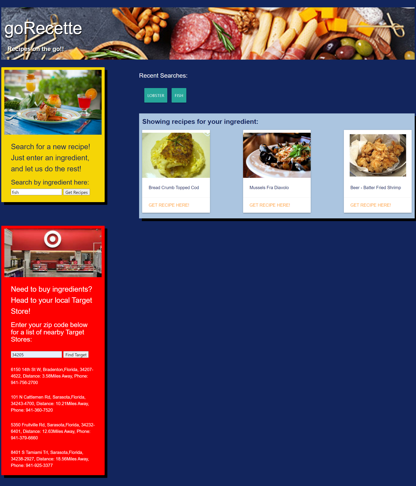

# goRecette
**As A** person who travels for work,  
**I WANT** a website that provides healthy recipes and locations to buy ingredients,  
**SO THAT** I can stay committed to my diet.

## Deployed Site
[goRecette](https://lf56.github.io/goRecette/)

## Made in Visual Studio using:
1. HTML
2. CSS
3. JavaScript
4. [jQuery](https://jquery.com/)
5. [Spoonacular Recipe and Food API](https://https://spoonacular.com/)
6. [Materialize CSS](https://materializecss.com/)
7. [Target Store API](https://rapidapi.com/logicbuilder/api/target-com-store-product-reviews-locations-data/)

## Screenshots

### Features:
* Search for recipes by ingredients
* Search for the nearest Target stores by zip code